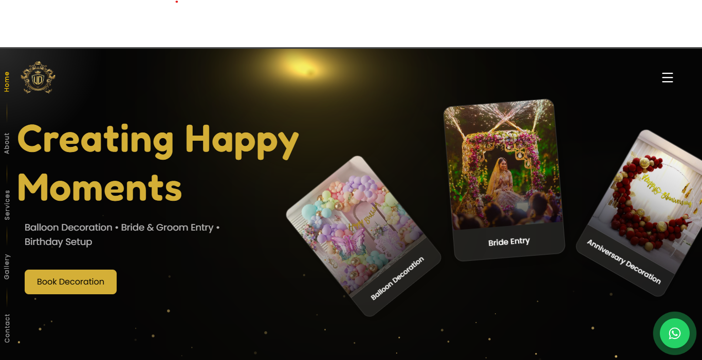

# Happy Moment Creator (udsfx)

A premium event decoration portfolio and service showcase website. This project is built with Next.js, designed to offer an immersive user experience with fluid animations, smooth scrolling, and interactive elements.

## 📸 Screenshot


## � Features

- **Modern Tech Stack**: Built with Next.js (App Router), TypeScript, and Tailwind CSS.
- **Smooth Scrolling**: Integrated `@studio-freight/lenis` for silky smooth scroll experiences.
- **Advanced Animations**: Powered by GSAP (GreenSock Animation Platform) and ScrollTrigger.
- **Interactive UI Elements**:
  - **Custom Cursors**: Animated and Golden cursor effects.
  - **Background Effects**: Fluid simulation and sparkles for visual depth.
  - **Spotlight & Mouse Glow**: Interactive lighting effects following user interaction.
- **Responsive Sections**: Includes Hero, About, Services, Gallery, Packages, Testimonials, and Contact modules.
- **Font Optimization**: Uses `next/font` with **Fredoka** and **Poppins**.
- **Analytics**: Integrated Vercel Analytics.

## 🛠️ Tech Stack

- **Framework**: Next.js 14+
- **Language**: TypeScript
- **Styling**: Tailwind CSS
- **Animation**: GSAP, Lenis
- **Deployment**: Vercel

## 📦 Getting Started

### Prerequisites

Ensure you have the following installed on your machine:
- Node.js (v18.17.0 or later recommended)
- Package manager (npm, yarn, pnpm, or bun)

### Installation

1. **Clone the repository:**
   ```bash
   git clone <repository-url>
   cd udsfx
   ```

2. **Install dependencies:**
   ```bash
   npm install
   # or
   yarn install
   # or
   pnpm install
   # or
   bun install
   ```

### 🏃‍♂️ Running the Development Server

Start the local development server:

```bash
npm run dev
# or
yarn dev
# or
pnpm dev
# or
bun dev
```

Open [http://localhost:3000](http://localhost:3000) with your browser to see the result.

You can start editing the page by modifying `app/page.tsx`. The page auto-updates as you edit the file.

This project uses [`next/font`](https://nextjs.org/docs/app/building-your-application/optimizing/fonts) to automatically optimize and load [Geist](https://vercel.com/font), a new font family for Vercel.

## Learn More

To learn more about Next.js, take a look at the following resources:

- [Next.js Documentation](https://nextjs.org/docs) - learn about Next.js features and API.
- [Learn Next.js](https://nextjs.org/learn) - an interactive Next.js tutorial.

You can check out [the Next.js GitHub repository](https://github.com/vercel/next.js) - your feedback and contributions are welcome!

## Deploy on Vercel

The easiest way to deploy your Next.js app is to use the [Vercel Platform](https://vercel.com/new?utm_medium=default-template&filter=next.js&utm_source=create-next-app&utm_campaign=create-next-app-readme) from the creators of Next.js.

Check out our [Next.js deployment documentation](https://nextjs.org/docs/app/building-your-application/deploying) for more details.
